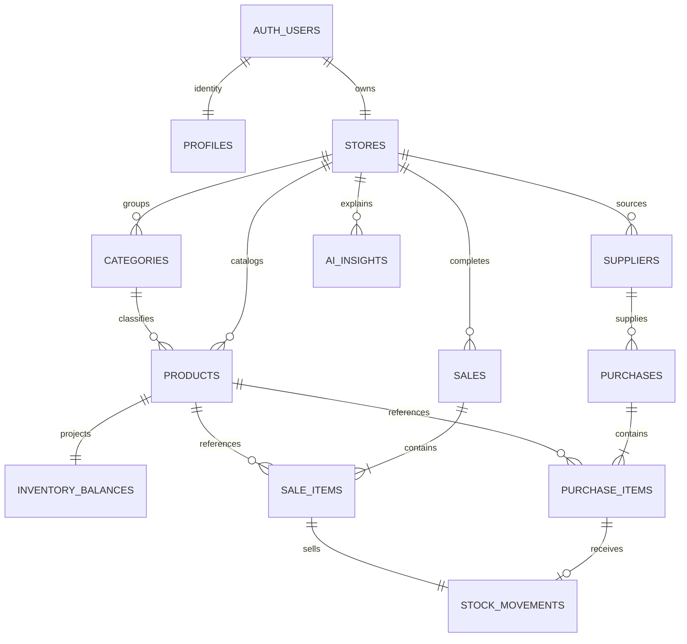

# Database contracts and integrity

## Relations

The schema implements the PRD names. `private.operation_requests`, `private.ai_request_windows`, and `private.ai_leases` are implementation-only tables. Categories/suppliers additionally carry version metadata for safe concurrent edits. `stores.demo_clock` is privileged local-fixture metadata; ordinary owners cannot modify it or `is_demo`.

All owned relationships use store-aware composite foreign keys where required. Unique normalized SKU/category names are scoped to store, including archived products. Historical relations use restrictive deletion, not destructive cascade. Purchase draft items are deleted explicitly under the draft-only rule. Every product has a zero-created balance; there is no mutable quantity on `products`.

## Exact money and time

`_paisa` fields are integer poisha, 1/100 BDT, stored with bounded PostgreSQL bigint/numeric arithmetic. `private.safe_json` serializes money fields and large revision/sequence values as decimal strings. TypeScript authoritative preview arithmetic uses BigInt, and formatted money never feeds back as trusted totals.

Costs are nonnegative; selling prices positive; per-line quantities are whole units 1–1,000,000; stock/minimum 0–1,000,000,000; unit price/cost at most 1,000,000,000 poisha; total/tender at most 1,000,000,000,000 poisha. Documents contain 1–100 unique product rows. A discount is fixed money, nonnegative and strictly less than subtotal. Tender covers net; change is tender minus net, not revenue.

Invoice `purchase_date` is separate from the server-created `received_at`. Sales use `completed_at`; stock movement timestamps come from their posting event. All persist as UTC timestamptz where appropriate. Dhaka date ranges use inclusive local start and exclusive midnight after the end date; reports permit at most 366 days. Clients cannot backdate stock through production RPCs.

## Ownership and grants

Exposed business tables grant owners SELECT through RLS. Direct authenticated inserts, updates and deletes are revoked for catalog, balances, movements, purchases, sales and AI records. The private schema has no public table access. Entry-point SECURITY DEFINER functions set a safe empty search path and fully qualify relations; they derive the owner/store from Auth, not submitted ownership fields. Default PUBLIC/anon execute is revoked. Ordinary application calls use the user's JWT, not an administrator key.

Catalog mutations, drafts, receipts, checkout, number allocation and revision updates acquire the owned store row lock first. Product locks are ordered by UUID. Different stores remain independent. No database locks are held during the external AI request.

## Posting transactions

`write_purchase(payload, request_id, receive)` validates supplier, activity, unique rows, exact amounts, quantity/stock limits and invoice date. A draft saves valid rows without balances or movements. Receipt captures supplier/store/product snapshots, changes the status once, allocates/reuses its number, increments balances and inserts exactly one positive movement per item, all in one transaction.

`complete_sale(payload, request_id)` checks every active product, current price/version, available stock, discount and tender. It captures a completed sale and immutable item/store/cashier/customer snapshots plus each product's current reference cost as immutable unit/line cost, decreases balances and inserts one negative movement per line. The cost snapshot keeps historical profit stable when catalog reference costs change later. Failure on any line rolls everything back, including document counters and operation records. No partial posting or reservations exist.

Each movement has exactly one purchase-item or sale-item source, with same-store/product FK identity and a unique source-item constraint. A guard verifies the source header is received/completed, delta matches item quantity and timestamp matches posting. Before/after satisfies `after = before + delta`. Posted headers/items/movements reject update/delete through immutable guards. Deferred constraint triggers compare each affected balance to the full committed movement sum from zero.

Migration 009 scopes this invariant query by store and product to use `movements_product_sequence`; it does not weaken or disable the check. Migration 010 selects parameter-aware plans for bounded reports because a generic plan regressed materially with 50,000 source lines. Both planner changes are function-scoped, not global database settings.

## Retry/version/number rules

`(store_id, operation_type, request_id)` identifies a committed operation. The server-created canonical JSON payload hash must match on replay. Identical success retries return the original result; a changed payload produces IDEMPOTENCY_CONFLICT. A failed transaction leaves no committed pending record. Minimal owned status is available via `get_operation_result`.

`save`, `delete`, and `receive` of a draft require expected version. Replay precedes version checking. A received draft returns its existing document link without another movement. Document counters are store-locked, unique per type, never reset by draft deletion, and may contain valid gaps. Stock reconstruction must never infer event order from document number; movement `sequence` is the stable ledger order.

## Read models, CSV and estimates

`get_workspace`, `list_catalog`, `list_documents`, `get_entity`, `get_report`, `get_attention`, and `get_insight_context` are owner-scoped read contracts. Supabase's 1000-row default is not used as an aggregate limit. Lists page at 20/50/100; totals are SQL aggregates over all matching records. Reports group by product/supplier UUID, not mutable names.

Purchase reports use actual historical captured costs and mark differing costs as a range/Various costs. Sales gross product values reconcile with one order discount per sale to net sales, then subtract immutable captured reference-cost lines to show net profit. This profit metric is before operating expenses and is not FIFO or weighted-average accounting profit. CSV uses all matching source lines up to 100,000, rejects overflow, escapes UTF-8 CSV and neutralizes formula-leading user text. Sales exports include captured unit/line cost, margin before discount, one order discount on the first stable item, and a net-profit contribution column whose sum reconciles to the report. Current inventory exports contain their own consistent generation snapshot; the UI explicitly says that download takes a fresh snapshot.

Out of stock is quantity zero regardless of minimum. Low is positive quantity below minimum. In stock is positive quantity at least minimum. Attention is the disjoint sum of low and zero. Shortage is max(minimum − available, 0), not predicted demand. Estimated value is current active quantity × editable reference cost. Products with remaining stock cannot be archived, preventing their value from disappearing.

## Safe development and retention

Never disable guards on a live database to correct a posted document. Only the explicit localhost fixture tooling temporarily adjusts historical fixture timestamps within a rollback-safe transaction, after the real posting functions create the complete ledger. It rejects remote/non-demo/nonempty targets. Test fault injection and synthetic data are isolated to disposable databases. Auth-user/store deletion must not cascade through completed history; administrative retention and operational reversal are outside this release.
